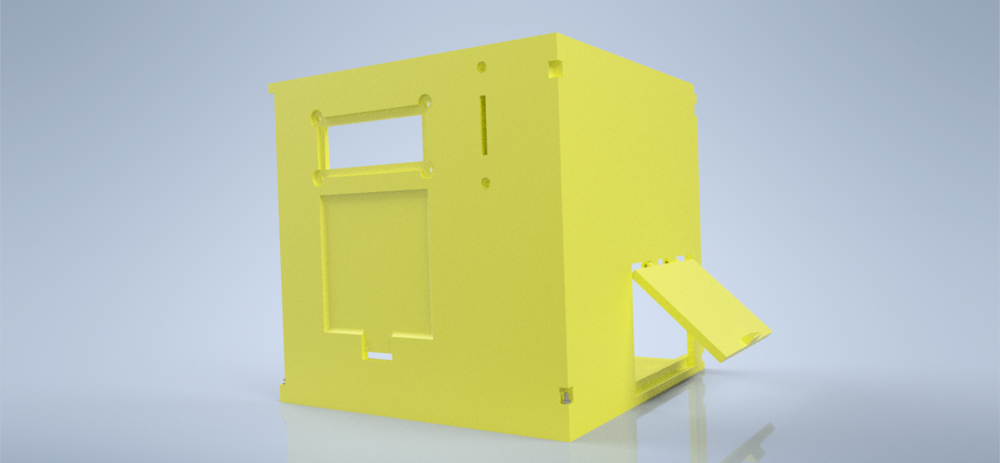
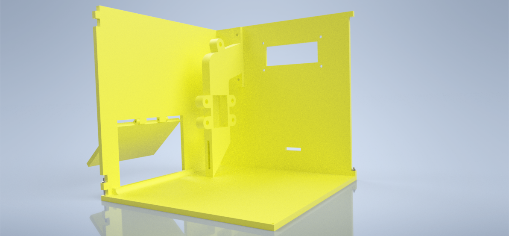

# Richbox

Richbox is a hardware prototype created during Arduino course. It functions as a piggy bank, but it can count the value of coins inside, 
set savings goals and unlock itself when the goal is reached. It is set up via bluetooth, which includes setting a password for manual unlocking,
setting a goal (either a coin value or a target date), and accessing information.

After creating a prototype, some 3D models and renders were created but they were never printed. Currently the project is archived and no 
further development is scheduled.

## Demo
Here is a GIF from the prototype demonstration: \

